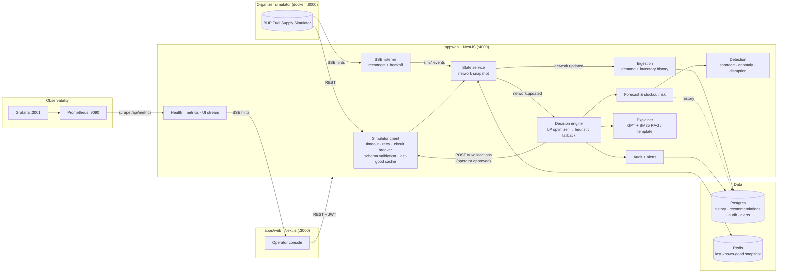

# 03 · Architecture

## The engineering loop in code
| Step | Component | File |
|---|---|---|
| Observe | poll + SSE, then a validated snapshot | `simulator/simulator.client.ts`, `simulator/simulator.stream.ts`, `state/state.service.ts` |
| Detect | edge-triggered detections, then alerts | `detection/detection.service.ts` |
| Predict | seasonal prior × learned level, then stockout ETA and probability | `forecast/forecast.math.ts`, `forecast/forecast.service.ts` |
| Decide | LP (javascript-lp-solver), falling back to a greedy heuristic | `decision/policies.ts`, `decision/decision.service.ts` |
| Simulate | what-if endpoint (no side effects) | `DecisionService.whatIf` |
| Act | operator approves; submitted with `idempotency_key = rec-<id>` | `DecisionService.execute` |
| Monitor | Prometheus metrics, health, audit log, UI stream | `metrics/`, `health/`, `audit/`, `realtime/` |
| Recover | circuit breaker half-open → closed; cache → fresh; recovery alerts | `simulator.client.ts`, `detection.service.ts` |

## Decision model
For each open station × fuel, `buildProblem()` computes:
- `cover = Σ forecast over (fastest transit + 12 ticks)`
- `target = min(0.95·capacity, cover·(1+2·cv) + 0.15·capacity)`
- `need = target − (inventory + in-transit)`
- `weight = 1 + 6·P(stockout) + 3·[ETA < 6 h]`

The LP maximises Σ weight·served − ε·transit subject to: served ≤ need, served ≤ Σ shipments, depot usable inventory (5% reserve kept back), depot dispatch per tick (halved when CONSTRAINED), station headroom, route `max_shipment`, and AVAILABLE routes only.

Fallbacks:

| Condition | Policy |
|---|---|
| Prediction service down | `heuristic_fallback` with a reorder-point rule (fill < 40% → refill to 80%) |
| LP error / infeasible | `heuristic_fallback` using forecast needs |
| Operator rollback | `heuristic` (forced) |
| Stale or degraded data | no new decisions (state is shown but not acted on) |
| Confidence < `MIN_CONFIDENCE_FOR_AUTO` | `NEEDS_REVIEW` |

## Resilience matrix
| Fault (inject from the Control page) | What happens | Evidence |
|---|---|---|
| `latency` | per-attempt timeout (3 s), then retry | `simulator_request_duration_seconds` |
| `error_rate` | retries with jittered backoff absorb most errors | `simulator_requests_total{outcome}` |
| `unavailable` | breaker opens, cached snapshot is served, UI shows the degraded banner, decisions pause; breaker half-opens after 10 s and closes on success | `simulator_circuit_state`, `platform_degraded_mode`, health panel |
| `stale_data` | snapshot flagged stale, not cached, decisions paused | `simulator_stale_responses_total` |
| `stream_disconnect` | SSE reconnects with backoff; 3 s polling keeps state fresh | `simulator_stream_connected` |
| Prediction down | heuristic fallback + system alert | `decision_fallback_total` |
| Redis down | cache writes skipped; health shows Redis degraded | health panel |
| Postgres down | TypeORM retries; health shows Database down | health panel |
| API down | web shows "backend unreachable" and keeps the last data it fetched | UI banner |

## Security
JWT roles (`operator`, `viewer`); operator-only actions are approve/reject, scenario control and policy change. Login is rate-limited to 10/min, the API to `RATE_LIMIT_PER_MIN` per IP. Helmet headers are on. Zod validates every inbound body and every simulator response. Environment is validated at boot. The authorization header is never logged.

## Intelligence upgrade

The ingestion path now uses a bounded Redis Streams consumer group before Postgres persistence, with direct persistence if Redis is unavailable. The API remains a single writer. The model path uses a rolling-error-weighted three-model ensemble; the Intelligence Lab exposes evaluations, model versions, replay, counterfactual policy comparisons and an offline Q-learning artifact.

GPT replaces the earlier Anthropic integration. Document BM25 retrieval and a bounded specialist workflow produce evidence-backed advice: retrieval → forecast → LP → deterministic constraint gate → independent GPT critique → GPT synthesis. The generated response cannot dispatch. See [09-intelligence.md](09-intelligence.md) for the updated diagram and limitations.
