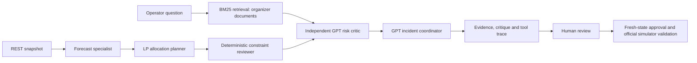

# Intelligence implementation and limits

The operational forecasting layer now uses trained Random Forest, Extra Trees and Gradient Boosting trees. See [trained forecasting evidence](11-trained-ml.md). The adaptive statistical ensemble below remains the automatic fallback and its live diagnostics are retained in Intelligence Lab.

## Statistical fallback model

The original fallback runs an adaptive ensemble (`adaptive-ensemble-2.0.0`) per station and fuel. Its candidates are seasonal EWMA, a recent local mean, and a seasonal level regression. Last-24 rolling-origin targets are predicted using only earlier observations; inverse candidate MAE determines weights. At cold start the seasonal prior receives all weight. Priors come from the organizer integration guide, not invented external data.

Weighted 90th-percentile candidate residuals form empirical bounds, widened by square-root horizon and by 1.5 under drift. These are **not a calibrated conformal coverage guarantee**: residual windows are short, correlated and also used for model weighting. The risk engine retains an approximate normal cumulative-demand model; its displayed probability is a planning estimate. Confidence is a heuristic based on sample count and dispersion, capped at 0.55 when normalized recent demand shifts more than 30% against its reference window.

The LP allocates stock under depot inventory/reserve, dispatch, route shipment, destination headroom and station/route availability constraints. Risk-weighted needs include uncertainty cover. If forecasting is disabled or optimization fails, a deterministic priority/reorder heuristic takes over. The what-if endpoint rejects infeasible changes as warnings and does not show a risk improvement for them. Approval refreshes simulator state and rejects stale or prior-tick recommendations.

Depot runway is a separate planning approximation: forecast burden is shared across reachable depots, and only dated supply arrivals replenish projected depot inventory. Delays/shortfalls therefore affect projected shortage warnings. This is not a second allocation ledger. Transport ETA uses known nominal transit plus mean observed arrival delay, with observed sample count shown.

## Grounded GPT workflow

`GPT_API_KEY` or `OPENAI_API_KEY` stays server-side. `OPENAI_MODEL` defaults to `gpt-4.1-mini`. The service uses [OpenAI Responses](https://developers.openai.com/api/docs/quickstart), `store:false`, a 25s timeout, output limits, a three-request concurrency bound, and endpoint rate limits. Provider failures yield labeled templates. GPT does not choose arbitrary tools, execute shell commands, change policy, or submit allocations. It critiques computed findings and synthesizes operator advice.

Retrieval is local **BM25 RAG**, not embedding/vector retrieval. The bundled corpus contains source document chunks with stable source line IDs. The UI shows retrieved text; prompts ask for exact source IDs and distinguish evidence from instructions. Grounding and prompts reduce but cannot eliminate hallucination. Generated prose is advisory; deterministic constraints and operator approval govern actions. The source documents, current simulated state and the question are sent to OpenAI. Secrets are never included in prompts.

The specialist workflow has bounded roles with an independent GPT critique and GPT synthesis. Forecast and optimization specialists are deterministic tools. This is inspectable orchestration rather than an unconstrained autonomous-agent claim.

## Experiments and replay

`POST /api/intelligence/evaluate` records candidate MAEs, weights, drift, sample counts, model version and simulator tick in the persistent audit store. A lack of history is displayed as zero validation samples, not evidence of zero forecasting error. `/intelligence/experiments` lists saved runs. Replay returns stored demand/inventory observations for a tick; it neither restores missing historical state nor rewinds the official simulator.

Counterfactuals compare a single allocation batch from no-action, heuristic and LP under mean-demand, demand-stress and combined delay-stress scenarios. Existing in-transit arrivals are held fixed; only proposed allocations receive the delay stress. No subsequent replenishment decisions are projected. Results are labeled estimated outcomes, not measured official-simulator performance.

## RL research

`python3 scripts/train_policy.py` trains tabular Q-learning on 2,500 approximate inventory episodes and evaluates 100 separate seeds against a reorder-point heuristic. State discretizes on-hand stock, in-transit stock and previous demand. Actions are 0/2,000/4,000/6,000 L. Reward penalizes unmet demand, holding stock, shipment volume and dispatch count. Capacity and a three-tick delivery delay are enforced in that approximate experiment.

The checked-in artifact records seeds, reward, action space, Q-table and policy comparison. Both policies achieved 100% service in this test; Q-learning shipped about 2.7% less fuel and had better aggregate reward. This result **does not establish superiority on the official multi-depot simulator**. RL remains research-only. The default operational policy is the constrained ML/LP hybrid.
